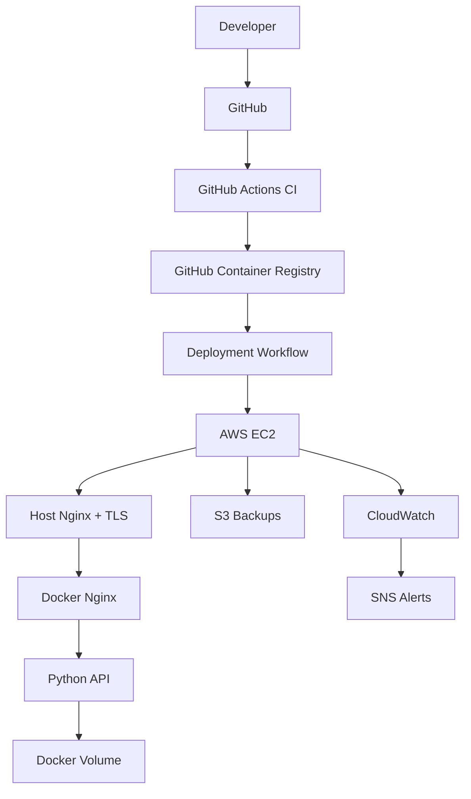

# Practical Lab 13: Final DevOps Capstone and Disaster Recovery

**Goal:** Prove that the complete system works as one professional DevOps project.

You will:

1. Implement a versioned application feature.
2. Run local quality and security checks.
3. Submit it through Git and a pull request.
4. Observe CI, image publication, and EC2 deployment.
5. Verify HTTPS and CloudWatch.
6. simulate CI and production failures.
7. Test automatic rollback.
8. Restore application data from S3.
9. Produce professional documentation.
10. Publish a GitHub release.

**Time:** Approximately 3–5 hours.

## Complete architecture

```text
Developer
    │
    │ feature branch + pull request
    ▼
GitHub
    │
    ├── Unit tests
    ├── Compose validation
    ├── Container builds
    ├── Nginx validation
    └── Integration tests
              │
              ▼
             GHCR
       web + API images
              │
              ▼
     GitHub Actions deployment
              │
     OIDC → temporary AWS role
              │
     Temporary SSH /32 rule
              ▼
┌──────────────────────────────────────────┐
│ AWS EC2                                  │
│                                          │
│ Host Nginx                               │
│   ├── TLS certificate                    │
│   ├── HTTP → HTTPS                       │
│   └── Proxy to 127.0.0.1:8080            │
│                │                         │
│                ▼                         │
│   Docker Compose                         │
│      ├── Nginx web container             │
│      ├── Python API container            │
│      └── Persistent volume               │
│                                          │
│ CloudWatch Agent → metrics and logs      │
│ S3 backup timer → encrypted backups      │
└──────────────────────────────────────────┘
```

---

# Phase 1: Record the healthy baseline

Before changing anything, record the current production state.

## Application

```bash
curl --fail "https://$APP_DOMAIN/nginx-health"
curl --fail "https://$APP_DOMAIN/api/health"
curl --fail "https://$APP_DOMAIN/api/info"
```

## Git

```bash
cd ~/devops-journey/01-linux-git
git switch main
git pull origin main
git status
git log --oneline --decorate -5
```

## GitHub Actions

```bash
gh run list --workflow ci.yml --limit 3
gh run list --workflow publish-images.yml --limit 3
gh run list --workflow deploy-ec2.yml --limit 3
```

## Production

```bash
ssh -i "$KEY_PATH" "ubuntu@$PUBLIC_IP"
```

```bash
cd /opt/devops-journey

cat LAST_DEPLOYMENT
docker compose -f compose.prod.yaml ps
docker compose -f compose.prod.yaml images
grep IMAGE .env
```

## Monitoring

From your local machine:

```bash
exit
```

```bash
aws cloudwatch describe-alarms \
  --alarm-name-prefix DevOpsJourney \
  --query 'MetricAlarms[].{Name:AlarmName,State:StateValue}' \
  --output table
```

Everything should be healthy before beginning the capstone.

---

# Phase 2: Create an immediate recovery point

Run an S3 backup before making changes.

Connect:

```bash
ssh -i "$KEY_PATH" "ubuntu@$PUBLIC_IP"
```

Run:

```bash
sudo systemctl start devops-journey-backup.service
```

Check:

```bash
sudo systemctl status \
  devops-journey-backup.service \
  --no-pager
```

View output:

```bash
sudo journalctl \
  -u devops-journey-backup.service \
  --since "10 minutes ago" \
  --no-pager
```

Record the S3 backup key from the logs.

List backups:

```bash
aws s3 ls \
  "s3://$BUCKET/backups/" \
  --recursive
```

Exit:

```bash
exit
```

---

# Phase 3: Implement a version endpoint

The capstone feature is:

```text
GET /api/version
```

Expected response:

```json
{
  "application": "devops-journey",
  "version": "1.0.0"
}
```

The website will display this version.

## 3.1 Create a feature branch

```bash
cd ~/devops-journey/01-linux-git

git switch main
git pull origin main
git switch -c feat/add-application-version
```

## 3.2 Create the version file

```bash
printf '1.0.0\n' > api/VERSION
```

## 3.3 Include it in the API image

Edit:

```bash
nano api/Dockerfile
```

Change:

```dockerfile
COPY server.py .
```

to:

```dockerfile
COPY server.py .
COPY VERSION .
```

## 3.4 Add the API helper

Edit:

```bash
nano api/server.py
```

Near the existing constants, add:

```python
VERSION_FILE = Path("/app/VERSION")
```

Add this function:

```python
def read_application_version():
    try:
        version = VERSION_FILE.read_text().strip()
    except OSError:
        return "unknown"

    return version or "unknown"
```

Inside `do_GET`, before the final `404` response, add:

```python
        if path == "/version":
            self.send_json(
                200,
                {
                    "application": "devops-journey",
                    "version": read_application_version(),
                },
            )
            return
```

Be careful to preserve Python indentation.

---

# Phase 4: Add automated tests

Edit:

```bash
nano api/test_server.py
```

Add these tests to the existing test class or create another `unittest.TestCase` class:

```python
class VersionTests(unittest.TestCase):
    def test_reads_application_version(self):
        with tempfile.TemporaryDirectory() as temporary_directory:
            version_file = Path(temporary_directory) / "VERSION"
            version_file.write_text("1.0.0\n")

            with patch.object(server, "VERSION_FILE", version_file):
                version = server.read_application_version()

            self.assertEqual(version, "1.0.0")

    def test_missing_version_returns_unknown(self):
        with tempfile.TemporaryDirectory() as temporary_directory:
            version_file = Path(temporary_directory) / "missing"

            with patch.object(server, "VERSION_FILE", version_file):
                version = server.read_application_version()

            self.assertEqual(version, "unknown")

    def test_empty_version_returns_unknown(self):
        with tempfile.TemporaryDirectory() as temporary_directory:
            version_file = Path(temporary_directory) / "VERSION"
            version_file.write_text("\n")

            with patch.object(server, "VERSION_FILE", version_file):
                version = server.read_application_version()

            self.assertEqual(version, "unknown")
```

Run:

```bash
python3 -m compileall -q api
```

```bash
python3 -m unittest discover \
  -s api \
  -p 'test_*.py' \
  -v
```

All existing and new tests should pass.

---

# Phase 5: Display the version in the website

Edit:

```bash
nano website/index.html
```

Add after the API status:

```html
<h2>Application version</h2>
<p id="application-version">Loading version...</p>
```

Edit:

```bash
nano website/app.js
```

Add:

```javascript
async function loadApplicationVersion() {
    const versionElement =
        document.getElementById("application-version");

    try {
        const response = await fetch("/api/version");

        if (!response.ok) {
            throw new Error(`HTTP ${response.status}`);
        }

        const data = await response.json();

        versionElement.textContent =
            `${data.application} version ${data.version}`;
    } catch (error) {
        versionElement.textContent =
            `Version request failed: ${error.message}`;
    }
}

loadApplicationVersion();
```

This code uses `textContent`, not `innerHTML`, to avoid injecting untrusted HTML.

---

# Phase 6: Run the complete local quality gate

## 6.1 Check whitespace and conflict markers

```bash
git diff --check
```

Search for unresolved merge conflicts:

```bash
git diff |
  grep -E '^\+?(<<<<<<<|=======|>>>>>>>)' &&
  echo "Conflict marker found" ||
  echo "No conflict markers"
```

## 6.2 Check Python

```bash
python3 -m compileall -q api
```

```bash
python3 -m unittest discover \
  -s api \
  -p 'test_*.py' \
  -v
```

## 6.3 Validate Compose

```bash
docker compose config --quiet
```

```bash
WEB_IMAGE=devops-journey-web:local \
API_IMAGE=devops-journey-api:local \
WEB_BIND_ADDRESS=127.0.0.1 \
WEB_PORT=8080 \
docker compose -f compose.prod.yaml config --quiet
```

## 6.4 Build the images

```bash
docker build \
  --tag devops-journey-web:capstone \
  .
```

```bash
docker build \
  --tag devops-journey-api:capstone \
  ./api
```

## 6.5 Run the development integration environment

Stop any previous local environment:

```bash
docker compose down --remove-orphans
```

Start:

```bash
docker compose up \
  --detach \
  --build \
  --wait
```

Verify services:

```bash
docker compose ps
```

Test:

```bash
curl --fail http://localhost:8080/nginx-health
curl --fail http://localhost:8080/api/health
curl --fail http://localhost:8080/api/info
curl --fail http://localhost:8080/api/version
```

Expected version response:

```json
{
  "application": "devops-journey",
  "version": "1.0.0"
}
```

## 6.6 Test Nginx

```bash
docker compose exec -T web nginx -t
```

## 6.7 Inspect logs

```bash
docker compose logs --tail=50
```

Look for exceptions, repeated restarts, and unexpected `4xx` or `5xx` responses.

---

# Phase 7: Perform a pre-commit security review

Inspect the change:

```bash
git diff
```

Search added lines for likely secrets:

```bash
git diff |
  grep '^+' |
  grep -iE \
    '(api_key|secret|password|token|passwd)[[:space:]]*=' ||
  echo "No obvious hardcoded secrets found"
```

Search for dangerous Python operations:

```bash
git diff |
  grep '^+' |
  grep -E \
    'os\.system\(|shell=True|eval\(|exec\(|pickle\.loads?\(' ||
  echo "No obvious dangerous Python operations found"
```

Review the checklist:

- [ ] No AWS credentials
- [ ] No GitHub tokens
- [ ] No private SSH keys
- [ ] No `.env` file added
- [ ] No hardcoded public IP required by the application
- [ ] No `innerHTML` with API data
- [ ] No Docker socket mounted into an application container
- [ ] API port 5000 remains unexposed
- [ ] Docker web port remains loopback-only in production
- [ ] Existing tests still pass
- [ ] New behavior has tests

Check ignored sensitive files:

```bash
git status --ignored
```

Never stage:

```text
*.pem
.env
.aws/
.ssh/
credentials
```

---

# Phase 8: Commit and create the feature PR

Stage only the intended files:

```bash
git add \
  api/VERSION \
  api/Dockerfile \
  api/server.py \
  api/test_server.py \
  website/index.html \
  website/app.js
```

Review exactly what will be committed:

```bash
git diff --staged
```

Commit:

```bash
git commit -m "feat: add application version endpoint"
```

Push:

```bash
git push -u origin feat/add-application-version
```

Create the pull request:

```bash
gh pr create \
  --base main \
  --head feat/add-application-version \
  --title "Add application version endpoint" \
  --body "$(cat <<'EOF'
## Summary

- Adds a version file to the API image
- Adds GET /api/version
- Displays the deployed version in the website
- Adds tests for valid, missing and empty version files

## Security

- API data is rendered with textContent
- No credentials or secrets are included
- Existing network exposure is unchanged

## Test plan

- [x] Python syntax validation passes
- [x] Unit tests pass
- [x] Development Compose configuration is valid
- [x] Production Compose configuration is valid
- [x] Web and API images build
- [x] Nginx configuration is valid
- [x] /api/version returns version 1.0.0
EOF
)"
```

---

# Phase 9: Observe CI/CD end to end

Watch pull-request checks:

```bash
gh pr checks --watch
```

Open the workflow:

```bash
gh run list \
  --branch feat/add-application-version \
  --limit 5
```

```bash
gh run view --web
```

When CI passes, squash merge:

```bash
gh pr merge --squash --delete-branch
```

Synchronize:

```bash
git switch main
git pull origin main
```

Now observe all three stages.

## CI

```bash
gh run list \
  --workflow ci.yml \
  --branch main \
  --limit 3
```

## Image publishing

```bash
gh run list \
  --workflow publish-images.yml \
  --limit 3
```

## EC2 deployment

```bash
gh run list \
  --workflow deploy-ec2.yml \
  --limit 3
```

Watch the deployment:

```bash
DEPLOY_RUN_ID="$(
  gh run list \
    --workflow deploy-ec2.yml \
    --limit 1 \
    --json databaseId \
    --jq '.[0].databaseId'
)"

gh run watch "$DEPLOY_RUN_ID"
```

---

# Phase 10: Verify production

Test HTTPS:

```bash
curl --fail "https://$APP_DOMAIN/nginx-health"
curl --fail "https://$APP_DOMAIN/api/health"
curl --fail "https://$APP_DOMAIN/api/info"
curl --fail "https://$APP_DOMAIN/api/version"
```

Expected:

```json
{
  "application": "devops-journey",
  "version": "1.0.0"
}
```

Open:

```text
https://YOUR_DOMAIN
```

Confirm the application version appears on the page.

## Verify the deployed images

```bash
ssh -i "$KEY_PATH" "ubuntu@$PUBLIC_IP"
```

```bash
cd /opt/devops-journey

cat LAST_DEPLOYMENT
grep IMAGE .env
docker compose -f compose.prod.yaml images
docker compose -f compose.prod.yaml ps
```

The image tag should match the commit-specific GHCR tag deployed by GitHub Actions.

---

# Incident Drill 1: Prove CI blocks invalid Nginx configuration

This incident happens only on a branch. It must never reach production.

Create a failure branch:

```bash
exit
```

```bash
cd ~/devops-journey/01-linux-git
git switch main
git pull origin main
git switch -c test/demonstrate-nginx-ci-failure
```

Edit:

```bash
nano nginx/default.conf
```

Inside the server block, add an invalid directive:

```nginx
this_directive_does_not_exist on;
```

Commit and push:

```bash
git add nginx/default.conf
git commit -m "test: demonstrate Nginx CI failure"
git push -u origin test/demonstrate-nginx-ci-failure
```

Create a draft PR:

```bash
gh pr create \
  --draft \
  --base main \
  --title "Demonstrate Nginx CI failure" \
  --body "Controlled failure drill. This PR must not be merged."
```

Watch:

```bash
gh pr checks --watch
```

The container integration test should fail at:

```bash
nginx -t
```

Inspect:

```bash
gh run view --log-failed
```

Expected error resembles:

```text
unknown directive "this_directive_does_not_exist"
```

Restore the valid configuration:

```bash
git restore nginx/default.conf
git add nginx/default.conf
git commit -m "test: restore valid Nginx configuration"
git push
```

Watch CI return to green:

```bash
gh pr checks --watch
```

Close the drill PR without merging:

```bash
gh pr close --delete-branch
git switch main
```

## Lesson

```text
Invalid configuration
       │
       ▼
CI integration test fails
       │
       ▼
Merge is blocked
       │
       ▼
Production is unchanged
```

---

# Incident Drill 2: Diagnose a production API outage

Record the start time in your incident notes.

Connect:

```bash
ssh -i "$KEY_PATH" "ubuntu@$PUBLIC_IP"
```

Stop only the API:

```bash
cd /opt/devops-journey
docker compose -f compose.prod.yaml stop api
```

Observe:

```bash
curl -i http://localhost/api/health
```

Expected:

```text
502 Bad Gateway
```

Check Nginx:

```bash
curl --fail http://localhost/nginx-health
```

This demonstrates:

```text
Nginx healthy + API unavailable = 502
```

Run the health monitor:

```bash
sudo systemctl start devops-journey-health.service
```

Inspect:

```bash
sudo systemctl status \
  devops-journey-health.service \
  --no-pager
```

Review logs:

```bash
docker compose -f compose.prod.yaml logs --tail=50 api
docker compose -f compose.prod.yaml logs --tail=50 web
```

Check host Nginx:

```bash
sudo tail -n 50 \
  /var/log/nginx/devops-journey-error.log
```

From your local machine, inspect CloudWatch:

```bash
exit
```

```bash
aws cloudwatch describe-alarms \
  --alarm-names \
    DevOpsJourney-Website-Unhealthy \
    DevOpsJourney-Container-Count-Low \
  --query 'MetricAlarms[].{Name:AlarmName,State:StateValue,Reason:StateReason}' \
  --output table
```

Recover:

```bash
ssh -i "$KEY_PATH" "ubuntu@$PUBLIC_IP"
```

```bash
cd /opt/devops-journey
docker compose -f compose.prod.yaml start api
docker compose -f compose.prod.yaml ps
```

Verify:

```bash
curl --fail http://localhost/api/health
sudo systemctl start devops-journey-health.service
```

Record:

- Detection time
- Diagnosis time
- Recovery time
- Root cause
- Commands used
- Monitoring signals

---

# Incident Drill 3: Test automatic deployment rollback

Trigger a nonexistent image:

```bash
exit
```

```bash
gh workflow run deploy-ec2.yml \
  --ref main \
  -f image_tag=sha-000000000000
```

Find the run:

```bash
ROLLBACK_TEST_RUN="$(
  gh run list \
    --workflow deploy-ec2.yml \
    --limit 1 \
    --json databaseId \
    --jq '.[0].databaseId'
)"

gh run watch "$ROLLBACK_TEST_RUN"
```

The workflow should fail while the rollback script restores the previous deployment.

Inspect:

```bash
gh run view "$ROLLBACK_TEST_RUN" --log-failed
```

Verify production stayed healthy:

```bash
curl --fail "https://$APP_DOMAIN/nginx-health"
curl --fail "https://$APP_DOMAIN/api/health"
curl --fail "https://$APP_DOMAIN/api/version"
```

Verify no temporary SSH rule remains:

```bash
aws ec2 describe-security-group-rules \
  --filters Name=group-id,Values="$SG_ID" \
  --query 'SecurityGroupRules[?contains(Description, `GitHub Actions`)]'
```

Expected:

```json
[]
```

---

# Disaster-Recovery Drill: Restore Docker data from S3

> This is intentionally destructive to the API counter. Perform it only in this learning environment.

## Step 1: Create known data

```bash
curl "https://$APP_DOMAIN/api/info"
curl "https://$APP_DOMAIN/api/info"
curl "https://$APP_DOMAIN/api/info"
```

Record the request-counter value.

## Step 2: Create and verify a fresh backup

```bash
ssh -i "$KEY_PATH" "ubuntu@$PUBLIC_IP"
```

```bash
sudo systemctl start devops-journey-backup.service
```

Find the backup key:

```bash
sudo journalctl \
  -u devops-journey-backup.service \
  --since "10 minutes ago" \
  --no-pager
```

Set it:

```bash
BACKUP_KEY="backups/HOST/YYYY/MM/DD/devops-journey-TIMESTAMP.tar.gz"
```

## Step 3: Download and verify

```bash
rm -rf /tmp/capstone-restore
mkdir -p /tmp/capstone-restore
cd /tmp/capstone-restore
```

```bash
ARCHIVE_NAME="$(basename "$BACKUP_KEY")"
```

```bash
aws s3 cp \
  "s3://$BUCKET/$BACKUP_KEY" \
  "$ARCHIVE_NAME"
```

```bash
aws s3 cp \
  "s3://$BUCKET/${BACKUP_KEY}.sha256" \
  "${ARCHIVE_NAME}.sha256"
```

Verify:

```bash
sha256sum -c "${ARCHIVE_NAME}.sha256"
```

Extract:

```bash
mkdir extracted
tar -xzf "$ARCHIVE_NAME" -C extracted
```

Verify internal checksums:

```bash
cd extracted
sha256sum -c SHA256SUMS
```

Do not continue unless every checksum reports `OK`.

## Step 4: Simulate volume data loss

Stop the application:

```bash
cd /opt/devops-journey
docker compose -f compose.prod.yaml stop web api
```

Clear the API volume:

```bash
docker compose -f compose.prod.yaml run \
  --rm \
  --no-deps \
  -T \
  api \
  sh -c '
    find /data -mindepth 1 -maxdepth 1 -exec rm -rf {} +
  '
```

Start:

```bash
docker compose -f compose.prod.yaml up \
  --detach \
  --wait
```

Call:

```bash
curl http://localhost/api/info
```

The counter should have reset, proving data was lost.

## Step 5: Restore from S3

Stop the application again:

```bash
docker compose -f compose.prod.yaml stop web api
```

Restore:

```bash
docker compose -f compose.prod.yaml run \
  --rm \
  --no-deps \
  -T \
  api \
  sh -c '
    find /data -mindepth 1 -maxdepth 1 -exec rm -rf {} +
    tar -xzf - -C /data
  ' < /tmp/capstone-restore/extracted/api-data.tar.gz
```

Start:

```bash
docker compose -f compose.prod.yaml up \
  --detach \
  --wait
```

Verify:

```bash
curl --fail http://localhost/nginx-health
curl --fail http://localhost/api/health
curl http://localhost/api/info
```

The restored counter should reflect the backup state.

Publish healthy monitoring data:

```bash
sudo systemctl start devops-journey-health.service
```

Exit:

```bash
exit
```

Verify publicly:

```bash
curl --fail "https://$APP_DOMAIN/nginx-health"
curl --fail "https://$APP_DOMAIN/api/health"
```

---

# Phase 11: Create a professional README

Your README should help another engineer understand, run, and evaluate the project.

Edit:

```bash
cd ~/devops-journey/01-linux-git
git switch main
git pull origin main
git switch -c docs/finalize-project-documentation
nano README.md
```

Use this structure:

```markdown
# DevOps Journey

[](https://github.com/USERNAME/devops-journey/actions/workflows/ci.yml)

A production-style DevOps project demonstrating Git, Docker,
GitHub Actions, Nginx, AWS EC2, S3, CloudWatch and automated
deployment.

## Live Application

- Website: https://YOUR_DOMAIN
- Health: https://YOUR_DOMAIN/nginx-health
- API health: https://YOUR_DOMAIN/api/health
- Version: https://YOUR_DOMAIN/api/version

## Architecture



## Technology Stack

- Git and GitHub
- GitHub Actions
- Docker and Docker Compose
- Nginx
- Python
- AWS EC2
- AWS S3
- AWS IAM and OIDC
- AWS CloudWatch
- AWS SNS
- Route 53
- Let's Encrypt and Certbot

## Repository Structure

```text
.
├── .github/workflows/
├── api/
├── deploy/
├── nginx/
├── scripts/
├── website/
├── compose.yaml
├── compose.prod.yaml
└── Dockerfile
```

## Local Development

```bash
docker compose up --build
```

Open http://localhost:8080.

## Testing

```bash
python3 -m unittest discover -s api -p 'test_*.py' -v
docker compose config --quiet
docker compose up -d --build --wait
docker compose exec -T web nginx -t
```

## CI/CD Pipeline

1. Pull request triggers validation and integration tests.
2. Merge to main publishes commit-tagged images to GHCR.
3. Deployment workflow authenticates to AWS using OIDC.
4. The GitHub runner receives temporary SSH access.
5. EC2 pulls the exact image tag.
6. Health checks verify the deployment.
7. Failed deployments automatically roll back.

## Security Controls

- Root account MFA
- Temporary AWS credentials
- Least-privilege IAM roles
- Private S3 bucket
- S3 encryption and versioning
- HTTPS-only application traffic
- SSH restricted to /32 addresses
- Strict SSH host-key validation
- Loopback-only Docker web port
- Unexposed API port
- Security headers and rate limiting
- IMDSv2 required
- Encrypted EBS volume

## Monitoring

CloudWatch collects:

- EC2 status and CPU
- Memory and disk usage
- Container count
- Website health
- System logs
- Docker logs

SNS sends alarm and recovery notifications.

## Backups and Recovery

- Daily systemd timer
- Encrypted S3 storage
- SHA-256 verification
- S3 lifecycle retention
- Versioned backup objects
- Documented restore procedure

## Deployment

Production images use commit tags:

```text
ghcr.io/OWNER/devops-journey-web:sha-COMMIT
ghcr.io/OWNER/devops-journey-api:sha-COMMIT
```

## Cost Management

- AWS budget alerts
- S3 lifecycle retention
- CloudWatch log retention
- Resource tagging
- Documented cleanup procedure

## License

Educational project.
```

Replace all placeholders before committing.

> If you do not want the public internet accessing your learning server, omit the live URL and terminate the infrastructure after taking screenshots.

---

# Phase 12: Write an incident runbook

Create:

```bash
mkdir -p docs
nano docs/runbook.md
```

Include:

```markdown
# Production Runbook

## Quick Health Check

```bash
curl --fail https://DOMAIN/nginx-health
curl --fail https://DOMAIN/api/health
```

## SSH Access

SSH is restricted by the EC2 security group. Never permanently
open port 22 to 0.0.0.0/0.

## Application Status

```bash
cd /opt/devops-journey
docker compose -f compose.prod.yaml ps
```

## Application Logs

```bash
docker compose -f compose.prod.yaml logs --tail=100
```

## Host Nginx

```bash
sudo nginx -t
sudo systemctl status nginx
sudo tail -n 100 /var/log/nginx/devops-journey-error.log
```

## CloudWatch Agent

```bash
sudo systemctl status amazon-cloudwatch-agent
sudo tail -n 100 \
  /opt/aws/amazon-cloudwatch-agent/logs/amazon-cloudwatch-agent.log
```

## Restart Application

```bash
docker compose -f compose.prod.yaml restart
docker compose -f compose.prod.yaml ps
```

## Manual Rollback

Use the GitHub Actions Deploy to EC2 workflow with a previous
commit-specific image tag.

## Backup

```bash
sudo systemctl start devops-journey-backup.service
```

## Restore

1. Download the backup and checksum.
2. Verify SHA-256.
3. Stop the application.
4. Clear the API data volume.
5. Extract the verified backup.
6. Start containers.
7. Run health checks.
8. Publish a healthy CloudWatch metric.

## Common HTTP Status Codes

- 200: request succeeded
- 301: HTTP redirected to HTTPS
- 404: resource not found
- 429: Nginx rate limit
- 502: upstream API unavailable
- 503: service unavailable
```

---

# Phase 13: Write the disaster-recovery report

Create:

```bash
nano docs/disaster-recovery.md
```

Document:

```markdown
# Disaster Recovery Test

## Date

YYYY-MM-DD

## Scope

Docker API volume restoration from an encrypted S3 backup.

## Recovery Point Objective

Maximum acceptable data loss based on daily backup frequency.

## Recovery Time Objective

Target time to download, verify and restore the latest backup.

## Test Procedure

1. Created known application state.
2. Ran backup service.
3. Verified archive and internal checksums.
4. Deleted volume data.
5. Confirmed application data loss.
6. Restored the archived volume.
7. Restarted the application.
8. Verified HTTPS and API health.
9. Confirmed CloudWatch returned to OK.

## Results

- Backup key:
- Checksum result:
- Restore start:
- Restore complete:
- Actual recovery time:
- Data recovered:
- Issues found:

## Improvements

- Increase backup frequency if required.
- Add backup-success alarms.
- Periodically automate restore testing.
- Consider multi-region backup replication.
```

---

# Phase 14: Review and merge documentation

Check placeholders:

```bash
grep -RIn \
  -E 'YOUR_|USERNAME|example\.com|YYYY-MM-DD' \
  README.md docs/ &&
  echo "Replace remaining placeholders" ||
  echo "No obvious placeholders found"
```

Check Git:

```bash
git diff --check
git status
git diff
```

Stage:

```bash
git add README.md docs/
```

Commit:

```bash
git commit -m "docs: finalize project and operations runbook"
```

Push:

```bash
git push -u origin docs/finalize-project-documentation
```

Create the PR:

```bash
gh pr create \
  --base main \
  --title "Finalize project documentation" \
  --body "$(cat <<'EOF'
## Summary

- Documents project architecture and technology stack
- Adds local development and test instructions
- Documents CI/CD and security controls
- Adds a production incident runbook
- Documents the disaster-recovery test

## Verification

- [x] Commands were exercised during the capstone
- [x] No credentials or private keys are documented
- [x] No placeholders remain
- [x] CI passes
EOF
)"
```

Watch:

```bash
gh pr checks --watch
```

Merge:

```bash
gh pr merge --squash --delete-branch
git switch main
git pull origin main
```

---

# Phase 15: Publish version 1.0.0

Confirm production and CI are healthy:

```bash
gh run list --branch main --limit 5
```

```bash
curl --fail "https://$APP_DOMAIN/api/version"
```

Create an annotated release tag:

```bash
git tag -a v1.0.0 \
  -m "DevOps Journey version 1.0.0"
```

Push:

```bash
git push origin v1.0.0
```

Get the release commit image tag:

```bash
RELEASE_SHA="$(git rev-parse --short=12 v1.0.0)"
OWNER="$(gh api user --jq '.login' | tr '[:upper:]' '[:lower:]')"
```

Create the GitHub release:

```bash
gh release create v1.0.0 \
  --title "DevOps Journey v1.0.0" \
  --notes "$(cat <<EOF
## DevOps Journey v1.0.0

First production-style release.

### Container images

- \`ghcr.io/$OWNER/devops-journey-web:sha-$RELEASE_SHA\`
- \`ghcr.io/$OWNER/devops-journey-api:sha-$RELEASE_SHA\`

### Features

- Dockerized Nginx frontend
- Python API
- GitHub Actions CI/CD
- Automated EC2 deployment and rollback
- HTTPS with automatic renewal
- S3 backup and restore
- CloudWatch monitoring and SNS alerts
- Production operations runbook
EOF
)"
```

View:

```bash
gh release view v1.0.0 --web
```

---

# Final acceptance checklist

## Git and GitHub

- [ ] Feature branches are used.
- [ ] Pull requests are reviewed.
- [ ] `main` is protected.
- [ ] CI is required before merge.
- [ ] Version `v1.0.0` is published.

## CI/CD

- [ ] Unit tests run automatically.
- [ ] Docker Compose is validated.
- [ ] Nginx configuration is tested.
- [ ] Integration tests exercise HTTP endpoints.
- [ ] Images are published to GHCR.
- [ ] Images use commit-specific tags.
- [ ] Deployment uses OIDC.
- [ ] Failed deployment rolls back.
- [ ] Temporary SSH access is removed.

## Docker and Nginx

- [ ] Both containers are healthy.
- [ ] API port 5000 is private.
- [ ] Docker web port is loopback-only.
- [ ] Host Nginx owns ports 80 and 443.
- [ ] HTTP redirects to HTTPS.
- [ ] Security headers are present.
- [ ] Rate limiting produces `429`.
- [ ] Missing pages produce custom `404`.
- [ ] Unavailable API produces `502`.

## AWS

- [ ] EC2 uses an encrypted EBS volume.
- [ ] IMDSv2 is required.
- [ ] Security groups expose only required ports.
- [ ] S3 is private and encrypted.
- [ ] S3 versioning and lifecycle retention are enabled.
- [ ] EC2 uses an IAM role without access keys.
- [ ] CloudWatch metrics and logs arrive.
- [ ] SNS notifications work.
- [ ] AWS budgets exist.

## Disaster recovery

- [ ] A backup was created.
- [ ] The archive checksum passed.
- [ ] Internal file checksums passed.
- [ ] Data loss was simulated.
- [ ] Data was restored from S3.
- [ ] The application returned to healthy.
- [ ] Recovery time was documented.

## Documentation

- [ ] README explains the architecture.
- [ ] Local setup works from the README.
- [ ] Security controls are documented.
- [ ] CI/CD flow is documented.
- [ ] The operations runbook contains tested commands.
- [ ] Disaster-recovery results are documented.
- [ ] No credentials or sensitive screenshots are published.

---

# Cost and cleanup review

If you are finished demonstrating the project, inspect costs and remove unneeded resources:

```bash
aws ec2 describe-instances \
  --filters Name=tag:Project,Values=devops-journey \
  --query 'Reservations[].Instances[].{ID:InstanceId,State:State.Name,IP:PublicIpAddress}' \
  --output table
```

Review:

- EC2 instance
- EBS volume
- Elastic IP
- Route 53 hosted zone
- S3 objects and versions
- CloudWatch logs
- CloudWatch alarms
- CloudWatch dashboard
- SNS topic
- IAM roles and instance profiles
- GHCR images

Do not delete the domain registration if you intend to reuse the domain. Domain registration fees are generally separate from hosted-zone and infrastructure cleanup.

---

# What you have completed

You now have hands-on experience with:

- **Git:** commits, branches, merges, tags, releases
- **GitHub:** repositories, pull requests, protected branches
- **GitHub Actions:** CI, container publishing, deployment, rollback
- **Docker:** images, containers, networking, volumes, Compose
- **Linux:** files, permissions, services, timers, logs, SSH
- **Nginx:** static hosting, reverse proxying, TLS, headers, rate limiting
- **AWS EC2:** instances, AMIs, EBS, security groups, IAM roles
- **AWS S3:** private storage, encryption, versioning, lifecycle, restore
- **CloudWatch:** metrics, logs, dashboards, alarms
- **SNS:** operational notifications
- **Route 53:** DNS and stable application addressing
- **Security:** MFA, OIDC, least privilege, IMDSv2, HTTPS
- **Operations:** monitoring, incident response, backups, disaster recovery

You have completed the original DevOps and cloud roadmap with a portfolio-ready practical project.

## Recommended next learning track

1. **Terraform** — recreate the AWS infrastructure as code
2. **Ansible** — automate EC2 host configuration
3. **AWS load balancing and Auto Scaling**
4. **Amazon ECR and ECS**
5. **Kubernetes fundamentals**
6. **Secrets Manager and Parameter Store**
7. **OpenTelemetry, Prometheus, and Grafana**
8. **Linux and cloud security hardening**